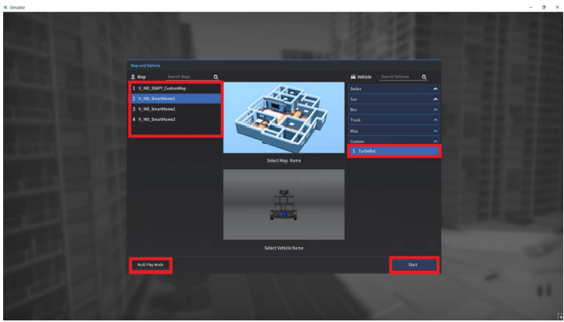

## IoT제어 프로젝트

* 시뮬레이터 및 프로젝트 관련 파일 다운로드
  - https://drive.google.com/drive/folders/1rp54qL31ZIoHet7A9BlvpoDCCdGVsvLK?usp=sharing

(위 경로에 위치한 프로그램 및 문서는 SSAFY 과정 내에서만 사용할 수 있으며 무단 복제 및 반출, 배포를 금합니다.)

- TEST 방법
  1. gitlab의 파일들을 clone한다.
  2. ROS2 설정 및 실행
  3. 시뮬레이터 설정
  4. 앱 동작

### ROS2 설정 및 실행

[참고자료](https://lab.ssafy.com/s05-iot-ctrl/S05P21D201/-/blob/sh/README/%EA%B0%9C%EB%B0%9C%ED%99%98%EA%B2%BD%20%EA%B5%AC%EC%B6%95%20%EB%A9%94%EB%89%B4%EC%96%BCv5.pdf)

1. ROS2 설치

2. 터미널창 실행 후 명령어 입력 (p21 참고)

3. 코드 빌드하기 (p25 참고, 깃랩에서 클론한 파일중 catkin_ws폴더에서 실행)

4. 빌드 후 `call 저장한주소\catkin_ws\install\local_setup.bat` 실행 p26 명령어 입력창 참고

5. sub3의 `final_launch.py`실행 p27 참고 (ssafy_bridge는 실행할 필요없습니다 , final_launch에 존재)

   `src\sub3\launch\`안에 파일존재 -> cd명령어로 폴더 이동하여 사용

- 서버에 ros2를 올려서 사용방법 연구중

### 시뮬레이터 설정

[참고자료](https://lab.ssafy.com/s05-iot-ctrl/S05P21D201/-/blob/sh/README/SSAFY%20%EC%8B%9C%EB%AE%AC%EB%A0%88%EC%9D%B4%ED%84%B0%20%EB%A9%94%EB%89%B4%EC%96%BCv5.pdf)

1. 시뮬레이터 설치하기

2. 로그인 하기

   ID : ssafy08

   PW : ssafy08

3. 맵과 터틀봇 선택하기

   

   Map : `2. V_IND_SmartHome1`, Vehicle : `1. TurtleBot`

4. 네트워크 세팅

   참고자료의 p15 ~ p16를 네트워크 세팅을 참고해주세요

5. 센서 설정

   참고자료의 p17 ~ P20를 참고해주세요

   - Camera Ground Truth는 기본출력인 None

6. 터틀봇 AutoMode 설정

   참고자료의 p10 ~ p12를 참고해주세요

   `Control Mode : AutoMode`로 설정해주세요

### 앱동작

 

